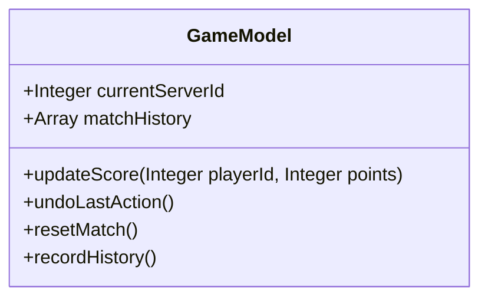
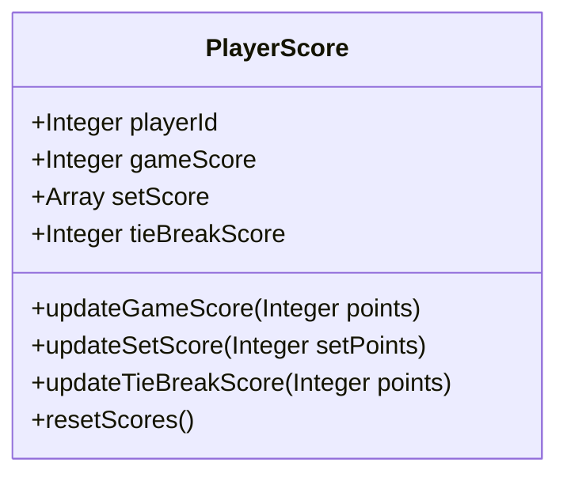
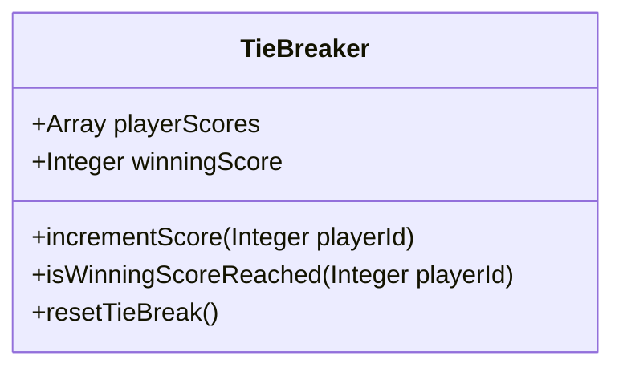
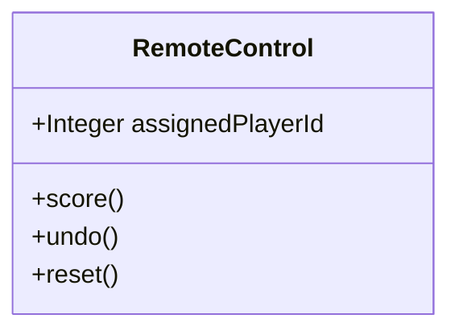
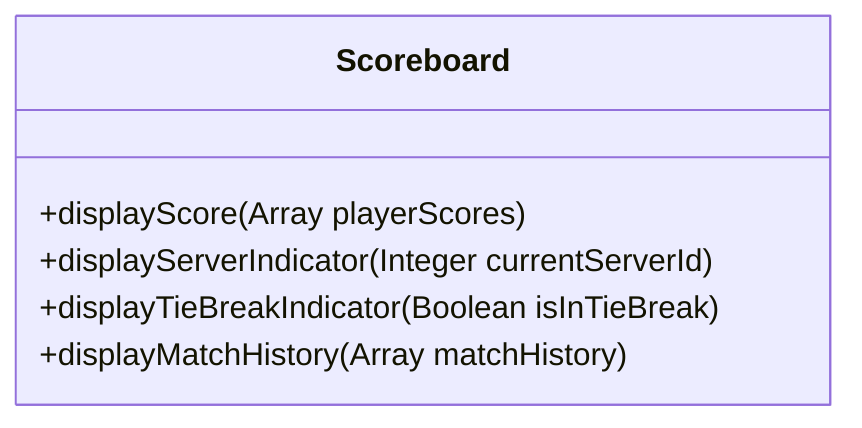
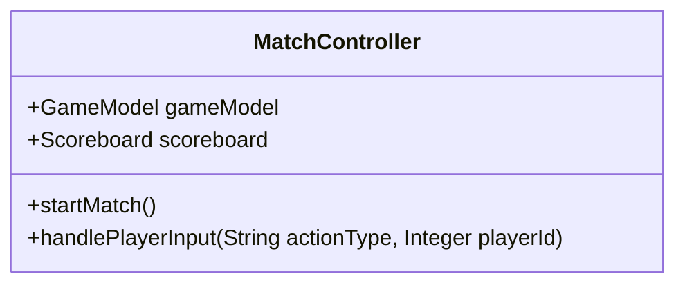

# 3. System Architecture and Components Design

## 3.1 System Architecture Overview

The digital tennis scoreboard system is designed with a modular architecture, allowing for clear separation of concerns among components. The architecture is divided into a model-view-controller (MVC) pattern to separate the data model, user interface, and control logic. 

### 3.1.1 High-Level Architecture

```mermaid
graph LR
    RC[Remote Control] -- Input --> MC[Match Controller]
    MC -- Updates --> GM[Game Model]
    GM -- Notifies --> SB[Scoreboard (View)]
    SB -- Displays --> UI((User Interface))
```

The **Remote Control** acts as the input device for players, which communicates player actions to the **Match Controller**. The **Match Controller** processes these inputs and updates the **Game Model** accordingly. The **Game Model** holds the current state of the match, including scores and player information. When the state changes, it notifies the **Scoreboard (View)**, which then updates the display visible to users through the **User Interface**.

## 3.2 Component Design

Each component of the system is designed to handle specific responsibilities within the architecture.

### 3.2.1 GameModel Component



The **GameModel** component manages the match state, including scores, server, and history.

### 3.2.2 PlayerScore Component



The **PlayerScore** component handles the scoring logic for each player.

### 3.2.3 TieBreaker Component



The **TieBreaker** component manages the logic and scoring during tie-breaks.

### 3.2.4 RemoteControl Component



The **RemoteControl** allows players to input score changes, undo actions, and reset the game.

### 3.2.5 Scoreboard (View) Component



The **Scoreboard (View)** displays the scores and match information as updated by the GameModel.

### 3.2.6 MatchController Component



The **MatchController** intermediates between the GameModel, Scoreboard, and player input to update the game state.

## 3.3 Data Design

Data design is focused on how the system's components will manage and utilize the data. The data structures are primarily arrays and integers that represent players, scores, and match history.
