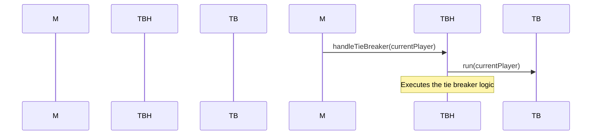

# Your role
- Expert C++ Developer
- Strong advocate of Test Driven Development
- World-class Developer of tennis scoring systems
- Expert using mermaid flowcharts
- Strong Advocate of using the SOLID principles of Object Oriented Design
- Gang of Four Design Patterns Expert

# Your tasks
- Simplify the following C++ updateScore method by breaking it into separate classes that each have a single responsibility.
- Don't give me a list of the SOLID principles.  Just silently apply them in your code.
- Keep in mind that we don't need classes made for the objects that are already in the code.  For example, the _gameState and _tieBreaker objects have already been defined.
- create a mermaid sequence diagram for each class that you create before you write the code for that class.
  
```cpp
void Mode1Score::updateScore( Player* currentPlayer ) {
    if ( _gameState->getTieBreak() == 1 ) {           // Tie Break
        _tieBreaker.run( currentPlayer );        
    } else if ( _gameState->getSetTieBreak() == 1 ) { // Set Tie Break
        _tieBreaker.setTieBreaker();            
    } else {                                          // Regular Game
        Player* otherPlayer = currentPlayer->getOpponent();
        int current_player_points = currentPlayer->getPoints();
        int other_player_points   = otherPlayer->getPoints();
        if ( current_player_points >= 3 ) {
            if ( current_player_points == other_player_points ) {
                currentPlayer->setPoints( 3 );
                otherPlayer->setPoints(   3 );
            } else if ( current_player_points > 3 
                && ( current_player_points - other_player_points ) > 1 ) {
                currentPlayer->setGames( currentPlayer->getGames() + 1);
                _undo.memory();
                currentPlayer->number() == 0 ? playerOneGameWin() : playerTwoGameWin(); } 

            if ( currentPlayer->getPoints() == 4 ) {
                _gameState->setPointFlash( 1 );       // "Ad" mode
                _gameState->setPreviousTime( GameTimer::gameMillis());
                _gameState->setToggle( 0 );
            }
        }
        _pointLeds.updatePoints();
    }
}
void Mode1Score::playerOneScore() { updateScore( _player1 );}
void Mode1Score::playerTwoScore() { updateScore( _player2 );}
``` 

# Existing C++ code for your reference
## Player Object C++ source code
```cpp
Player::Player( GameState* gamestate, int playerNumber ) : _gameState( gamestate ), _playerNumber( playerNumber ) {
        _points = 0; _games = 0; _sets = 0; _matches = 0; _mode = 0; _setting = 0; 
        _game_history[ 1 ] = 0; _game_history[ 2 ] = 0; _game_history[ 3 ] = 0;     // initialize game history
        _set_history[  1 ] = 0;  _set_history[ 2 ] = 0; _set_history[  3 ] = 0; }   // initialize set history
Player::~Player() {}

void Player::setServeSwitch( int serve_switch ) { _serve_switch = serve_switch; } 
int Player::getServeSwitch() { return _serve_switch; }
void Player::setOpponent( Player* opponent ) { _opponent = opponent; }                                  
Player* Player::getOpponent() { return _opponent; }
void Player::setSets( GameState* gameState, int sets ) {                         // sets this player's sets
    this->setSetHistory(      gameState->getCurrentSet(), _games               ); // and set history for both
    _opponent->setSetHistory( gameState->getCurrentSet(), _opponent->getGames()); // players
    if( _playerNumber == PLAYER_1_INITIALIZED ) { 
        gameState->setPlayer1SetHistory( this->getSetHistory());
        gameState->setPlayer2SetHistory( _opponent->getSetHistory()); }
    else {
        gameState->setPlayer1SetHistory( _opponent->getSetHistory());
        gameState->setPlayer2SetHistory( this->getSetHistory()); }
    _sets = sets; }                                          
int Player::getSets() { return _sets; }

void Player::setPoints(int points) { _points = points; } 
int Player::getPoints() {  return _points;  }

void Player::setGames( int games ) { 
    _set_history[ _gameState->getCurrentSet()] = games;
    number() == PLAYER_1_INITIALIZED ? 
        _gameState->setPlayer1Games( games ) : _gameState->setPlayer2Games( games );
    _games = games; }         

int Player::getGames() { return _games; }

void Player::setMatches(int matches) { _matches = matches; } int Player::getMatches() { return _matches; }
void Player::setMode(int mode) { _mode = mode; }             int Player::getMode() {    return _mode;    }
void Player::setSetting(int setting) { _setting = setting; } int Player::getSetting() { return _setting; }
int Player::incrementSetting() { return ++_setting; }
int Player::number() { 
    // std::cout << "Player::number() returning " << _playerNumber << std::endl;
    return _playerNumber; }

void Player::setSetHistory( int set, int games ) {
    std::cout << "setting set history for player " << number() << " set " << set << " to " << games << std::endl;
    _set_history[  set ] = games; 
    number() == PLAYER_1_INITIALIZED ? 
        _gameState->setPlayer1SetHistory( _set_history ) : _gameState->setPlayer2SetHistory( _set_history ); } 
std::map< int, int> Player::getSetHistory() { 
    return _set_history; }

void Player::setGameHistory( int game, int score ) { _game_history[ game ] = score; } 
std::map< int, int> Player::getGameHistory() { return _game_history;}
```

