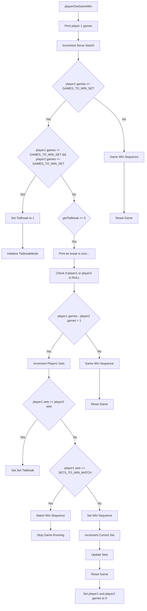

# Your role
- Expert C++ Developer
- Expert using mermaid flowcharts
- World-class Developer of tennis scoring systems

# Your task
- Create a mermaid flowchart for the game-win scenarios below

```cpp
- void Mode1Score::playerOneGameWin() {
    std::cout << "player 1 games: " << _player1->getGames() << std::endl;
    _gameState->setServeSwitch( _gameState->getServeSwitch() + 1 );
    if ( _player1->getGames() >= GAMES_TO_WIN_SET ) {
        if ( _player1->getGames() == GAMES_TO_WIN_SET && _player2->getGames() == GAMES_TO_WIN_SET ) {
            _gameState->setTieBreak( 1 );
            _tieBreaker.initializeTieBreakMode(); }
        if ( _gameState->getTieBreak() == 0 ) {
            std::cout << "*** tie break is zero.  checking if difference is 2... ***" << std::endl;
            if( !_player1 || !_player2 ) { std::cout << "*** ERROR: player1 or player2 is NULL.  exiting... ***" << std::endl; exit( 1 ); }
            std::cout << "*** player1 games: " << _player1->getGames() << " player2 games: " << _player2->getGames() << std::endl;
            if (( _player1->getGames() - _player2->getGames()) > 1 ) {
                std::cout << "*** setting sets for player 1... ***" << std::endl;
                _player1->setSets( _gameState, _player1->getSets() + 1 ); // <-------------<< Increment Player Sets
                _setLeds.updateSets();
                if ( _player1->getSets() == _player2->getSets()) {        // <-------------<< Set Tie Break
                    std::cout << "*** calling p1TBSetWinSequence() ***" << std::endl;
                    _mode1WinSequences.p1TBSetWinSequence();
                    _gameState->setSetTieBreak( 1 );
                    _tieBreaker.setTieBreakEnable();
                } else if ( _player1->getSets() == SETS_TO_WIN_MATCH ) {
                    std::cout << "*** calling p1MatchWinSequence() ***" << std::endl;
                    _mode1WinSequences.p1MatchWinSequence();             // <-------------<< Match Win
                    _gameState->stopGameRunning();
                } else {     
                    std::cout << "calling game win sequence 1st..." << std::endl; // <-------------<< Set Win
                    std::cout << "*** /// calling p1SetWinSequence() point gap is 2 /// ***" << std::endl;
                    _gameState->setPlayer1SetHistory( _player1->getSetHistory());
                    _gameState->setPlayer2SetHistory( _player2->getSetHistory());
                    GameTimer::gameDelay( SET_WIN_DELAY );
                    _mode1WinSequences.p1SetWinSequence();  // call set win before incrementing set
                    _gameState->setCurrentSet( _gameState->getCurrentSet() + 1 ); // moved here sep4
                    _setLeds.updateSets();
                    GameTimer::gameDelay( _gameState->getWinDelay());
                    _resetGame(); }
                    std::cout << "*** setting games to 0 ***" << std::endl; // after incrementing set! -sep11
                    _player1->setGames( 0 );
                    _player2->setGames( 0 );
            } else {    // no set win, no match win, no tie break. just a regular game win.
                std::cout << "*** calling p1GameWinSequence() ***" << std::endl;
                _gameLeds.updateGames();
                _gameState->setPlayer1SetHistory( _player1->getSetHistory());  // gamestate needs update here
                _gameState->setPlayer2SetHistory( _player2->getSetHistory());
                _mode1WinSequences.p1GameWinSequence();  // sets player points to zero
                _resetGame();
            }}
    } else {
        std::cout << "*** calling p1GameWinSequence() ***" << std::endl;
        _gameLeds.updateGames();
        _gameState->setPlayer1SetHistory( _player1->getSetHistory());
        _gameState->setPlayer2SetHistory( _player2->getSetHistory());
        _mode1WinSequences.p1GameWinSequence();
        _resetGame(); 
    }}
```

