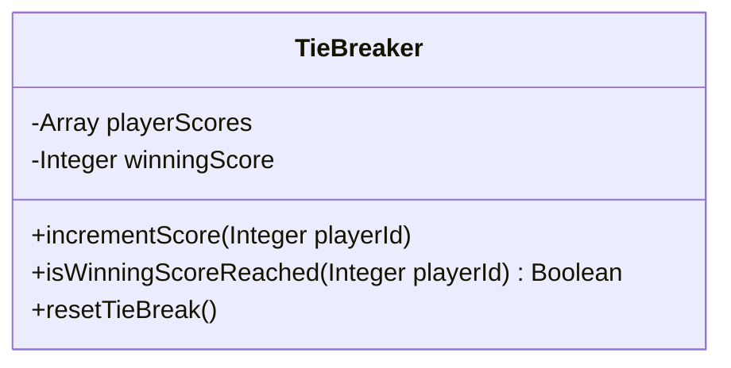

```mermaid
classDiagram
    class TieBreaker {
      -Array playerScores
      -Integer winningScore
      +incrementScore(Integer playerId)
      +isWinningScoreReached(Integer playerId) Boolean
      +resetTieBreak()
    }
```