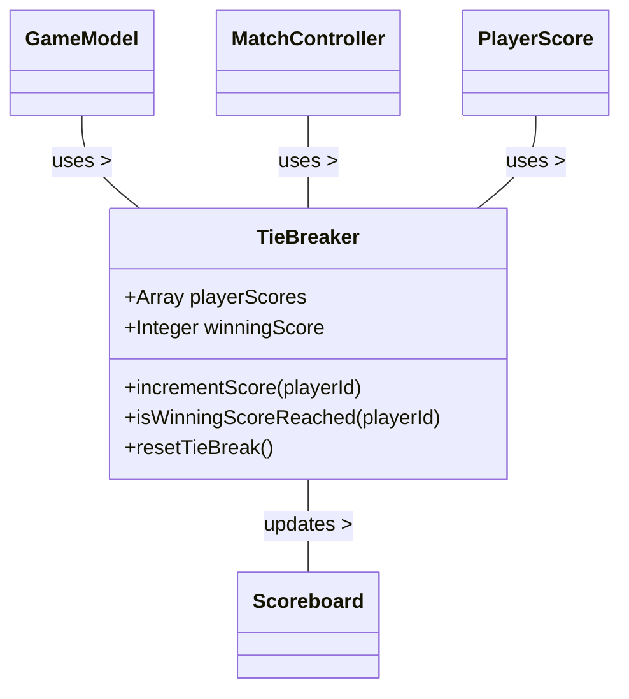

```mermaid
classDiagram
    GameModel -- TieBreaker : uses >
    MatchController -- TieBreaker : uses >
    PlayerScore -- TieBreaker : uses >
    TieBreaker -- Scoreboard : updates >

    class TieBreaker{
      +Array playerScores
      +Integer winningScore
      +incrementScore(playerId)
      +isWinningScoreReached(playerId)
      +resetTieBreak()
    }
```