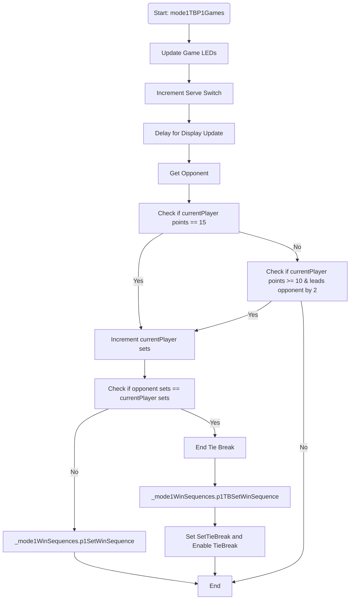

```mermaid
graph TD
    start(Start: mode1TBP1Games)
    updateLeds[Update Game LEDs]
    serveSwitch[Increment Serve Switch]
    delay[Delay for Display Update]
    getOpponent[Get Opponent]
    checkTieBreakWin[Check if currentPlayer points == 15]
    checkGameWin[Check if currentPlayer points >= 10 & leads opponent by 2]
    setSets[Increment currentPlayer sets]
    checkOpponentSets[Check if opponent sets == currentPlayer sets]
    endTieBreak[End Tie Break]
    winSequence1[_mode1WinSequences.p1TBSetWinSequence ]
    setTieBreak[Set SetTieBreak and Enable TieBreak]
    winSequence2[_mode1WinSequences.p1SetWinSequence ]
    theend[End]

    start --> updateLeds
    updateLeds --> serveSwitch
    serveSwitch --> delay
    delay --> getOpponent
    getOpponent --> checkTieBreakWin
    checkTieBreakWin -- Yes --> setSets
    checkTieBreakWin -- No --> checkGameWin
    checkGameWin -- Yes --> setSets
    setSets --> checkOpponentSets
    checkOpponentSets -- Yes --> endTieBreak
    checkOpponentSets -- No --> winSequence2
    endTieBreak --> winSequence1
    winSequence1 --> setTieBreak
    winSequence2 --> theend
    setTieBreak --> theend
    checkGameWin -- No --> theend
```