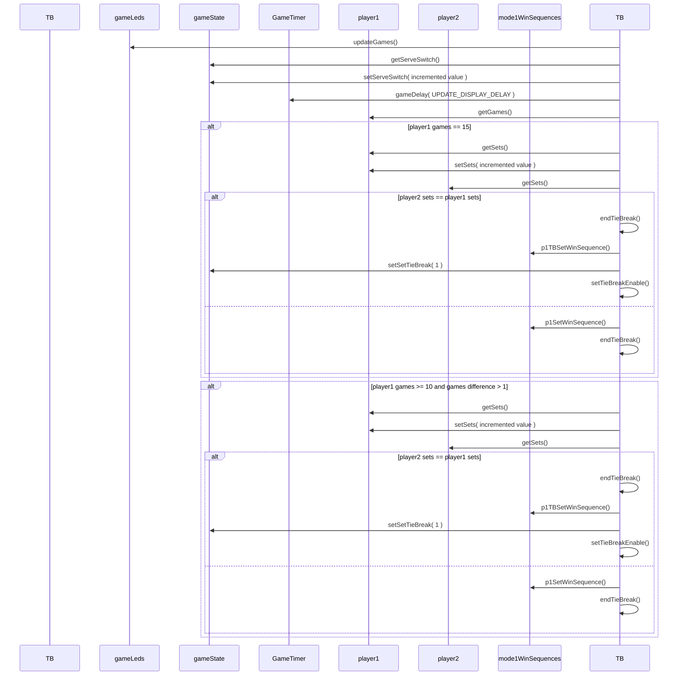

```mermaid
sequenceDiagram
    participant TieBreaker as TB
    participant gameLeds
    participant gameState
    participant GameTimer
    participant player1
    participant player2
    participant mode1WinSequences

    TB->>gameLeds: updateGames()
    TB->>gameState: getServeSwitch()
    TB->>gameState: setServeSwitch( incremented value )
    TB->>GameTimer: gameDelay( UPDATE_DISPLAY_DELAY )
    TB->>player1: getGames()

    alt player1 games == 15
        TB->>player1: getSets()
        TB->>player1: setSets( incremented value )
        TB->>player2: getSets()

        alt player2 sets == player1 sets
            TB->>TB: endTieBreak()
            TB->>mode1WinSequences: p1TBSetWinSequence()
            TB->>gameState: setSetTieBreak( 1 )
            TB->>TB: setTieBreakEnable()
        else
            TB->>mode1WinSequences: p1SetWinSequence()
            TB->>TB: endTieBreak()
        end
    end

    alt player1 games >= 10 and games difference > 1
        TB->>player1: getSets()
        TB->>player1: setSets( incremented value )
        TB->>player2: getSets()

        alt player2 sets == player1 sets
            TB->>TB: endTieBreak()
            TB->>mode1WinSequences: p1TBSetWinSequence()
            TB->>gameState: setSetTieBreak( 1 )
            TB->>TB: setTieBreakEnable()
        else
            TB->>mode1WinSequences: p1SetWinSequence()
            TB->>TB: endTieBreak()
        end
    end

```