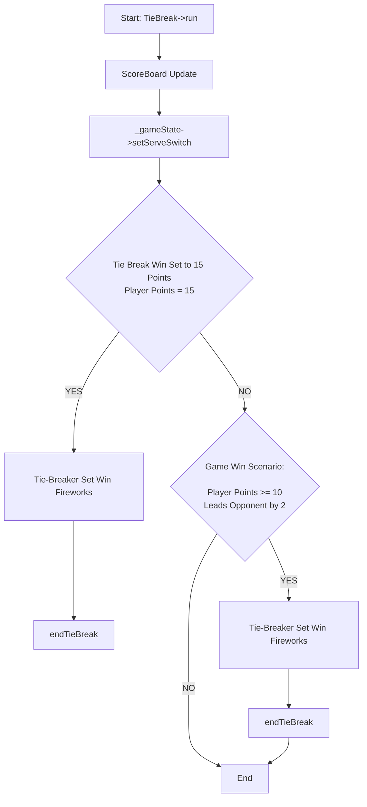

# Your Role
- Expert C++ Developer
- My helpful assistant
- A Software Design Pattern GoF Expert
- A Developer who always adheres to the SOLID Principles of Object Oriented Design

# Your Task
- Create a C++ method to conform to the Flowchart below
- Use a Player object passed in as the current player.  Use the Player object's method getOpponent() method to get a pointer to the opponent Player Object.

# The Mermaid Flowchart describing the method you need to create


# Your Solution
```cpp
class Player {
public:
    int getPoints() const;
    Player* getOpponent() const;
    // ... other methods and members
};

class GameState {
public:
    void setServeSwitch();
    // ... other methods and members
};

class ScoreBoard {
public:
    void update();
    // ... other methods and members
};

class TieBreak {
private:
    GameState* _gameState;
    ScoreBoard _scoreBoard;

    void displayFireworks() {
        // logic to display fireworks
    }

public:
    void run(Player& currentPlayer) {
        _scoreBoard.update();
        _gameState->setServeSwitch();

        if (currentPlayer.getPoints() == 15) {
            displayFireworks();
            // end tiebreak
            return;
        }

        Player* opponent = currentPlayer.getOpponent();
        if (currentPlayer.getPoints() >= 10 && 
            (currentPlayer.getPoints() - opponent->getPoints() >= 2)) {
            displayFireworks();
            // end tiebreak
            return;
        }

        // end the method if neither condition is met
    }
};
```

## link to gpt4 chat session
https://chat.openai.com/share/0f0afbb8-82d8-42c3-bb3c-215332395873

## gpt-3.5 answer
https://chat.openai.com/share/1b6037d3-0c6e-4f2a-a1c6-5039338808b8
