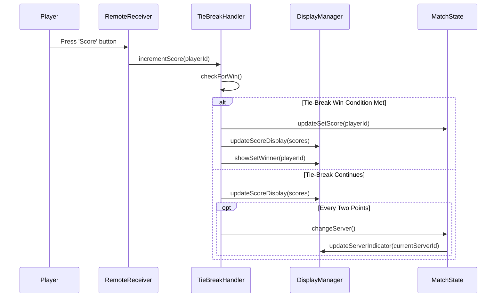

```mermaid
sequenceDiagram
    participant P as Player
    participant R as RemoteReceiver
    participant TB as TieBreakHandler
    participant DM as DisplayManager
    participant MS as MatchState

    P->>R: Press 'Score' button
    R->>TB: incrementScore(playerId)
    TB->>TB: checkForWin()
    alt Tie-Break Win Condition Met
        TB->>MS: updateSetScore(playerId)
        TB->>DM: updateScoreDisplay(scores)
        TB->>DM: showSetWinner(playerId)
    else Tie-Break Continues
        TB ->> DM: updateScoreDisplay(scores)
        opt Every Two Points
            TB->>MS: changeServer()
            MS->>DM: updateServerIndicator(currentServerId)
        end
    end
```