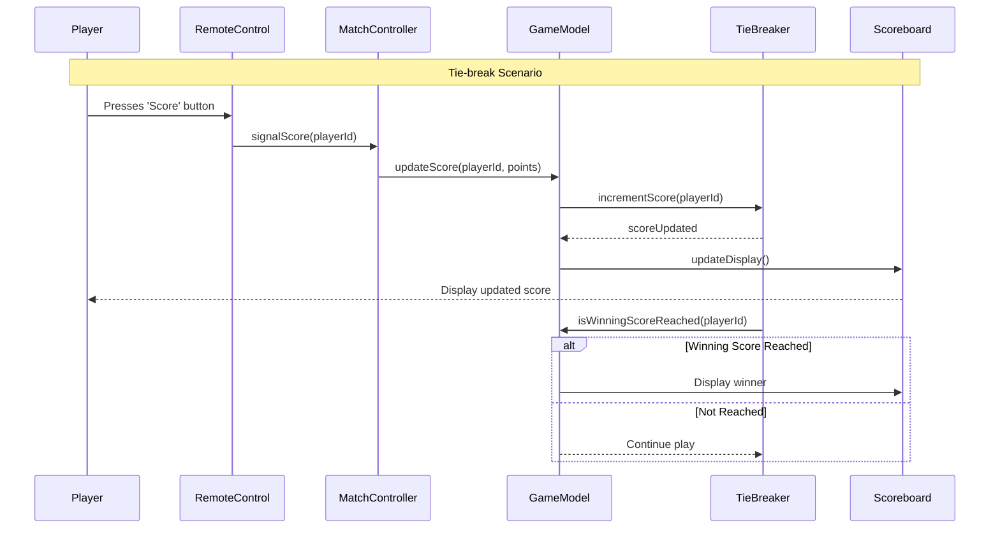

```mermaid
sequenceDiagram
    participant Player as Player
    participant RemoteControl as RemoteControl
    participant MatchController as MatchController
    participant GameModel as GameModel
    participant TieBreaker as TieBreaker
    participant Scoreboard as Scoreboard

    Note over Player, Scoreboard: Tie-break Scenario
    Player ->> RemoteControl: Presses 'Score' button
    RemoteControl ->> MatchController: signalScore(playerId)
    MatchController ->> GameModel: updateScore(playerId, points)
    GameModel ->> TieBreaker: incrementScore(playerId)
    TieBreaker -->> GameModel: scoreUpdated
    GameModel ->> Scoreboard: updateDisplay()
    Scoreboard -->> Player: Display updated score
    TieBreaker ->> GameModel: isWinningScoreReached(playerId)
    alt Winning Score Reached
        GameModel ->> Scoreboard: Display winner
    else Not Reached
        GameModel -->> TieBreaker: Continue play
    end
```
